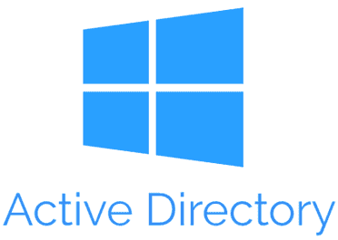
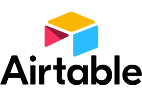
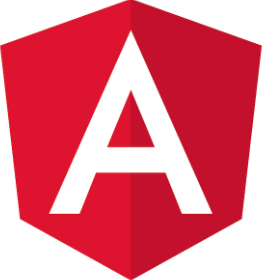

##### Assignment 01

## Technology Categories

# Report Title
## Table of Contents
## Technology Categories

### Technology Category: 
#### [.Net Core](https://dotnet.microsoft.com/en-us/)
#### Term 2
...
### Technology Category N
#### Term M1
#### Term M2
...
## Changelog
...
## Miscellaneous Notes
...

1. [Official Site](https://dotnet.microsoft.com/en-us/)

<!-- to 2. dn exw vrei to repo kai license key -->

| ID | Technology | Logo | Description | Hyperlink and License Key|
|----|------------|:----:|-------------|:-------------------------|
|1.  | .Net Core  |  | .NET Core is an open-source, cross-platform framework for building modern applications. It provides a runtime, libraries, and tools to develop applications for various platforms, including Windows, macOS, and Linux. | [Official Site](https://dotnet.microsoft.com/en-us/)   [Wiki](https://en.wikipedia.org/wiki/.NET)   [Version Control Repository](https://github.com/dotnet/core)   [License Key](https://en.wikipedia.org/wiki/MIT_License) | 
|2.  | Active Directory  |  | Active Directory is a directory service developed by Microsoft that provides centralized authentication, authorization, and management of network resources in a Windows environment. It enables administrators to manage users, groups, computers, and other network components.  | **Official Site:** https://www.windows-active-directory.com/active-directory-sites.html   **Wiki:** https://en.wikipedia.org/wiki/Active_Directory    **Version Control Repository:** ~~~~   **License Key:** |
|3.  | Airtable  |  | Airtable is a cloud-based collaboration platform that combines the functionality of a spreadsheet with a database. It allows users to organize and track data, collaborate with team members, and create customizable workflows.  | **Official Site:** https://dotnet.microsoft.com/en-us/   **Wiki:** https://en.wikipedia.org/wiki/.NET    **Version Control Repository:** https://github.com/dotnet/core   **License Key:** | 
|4.  |  Alfresco |  |  Alfresco is an open-source enterprise content management platform that enables organizations to manage, collaborate on, and distribute digital content. It provides document management, records management, workflow automation, and collaboration features.  | **Official Site:** https://dotnet.microsoft.com/en-us/   **Wiki:** https://en.wikipedia.org/wiki/.NET    **Version Control Repository:** https://github.com/dotnet/core   **License Key:** |
|5.  | Angular  |  | Angular is a popular JavaScript framework for building web applications. It provides a structured approach to web development and offers features like two-way data binding, dependency injection, and modular architecture.  | **Official Site:** https://dotnet.microsoft.com/en-us/   **Wiki:** https://en.wikipedia.org/wiki/.NET    **Version Control Repository:** https://github.com/dotnet/core   **License Key:** |
|6.  | Apache HTTP Server  |  | Apache HTTP Server, often referred to as Apache, is a widely used open-source web server software. It powers a significant portion of websites on the internet and supports various technologies like PHP, Perl, and Python for dynamic content.  | **Official Site:** https://dotnet.microsoft.com/en-us/   **Wiki:** https://en.wikipedia.org/wiki/.NET    **Version Control Repository:** https://github.com/dotnet/core   **License Key:** | 
|7.  | AtoM  |  | AtoM is an open-source web-based application designed for managing and providing access to archival and museum collections. It facilitates the description, organization, and dissemination of digital and analog records.  | **Official Site:** https://dotnet.microsoft.com/en-us/   **Wiki:** https://en.wikipedia.org/wiki/.NET    **Version Control Repository:** https://github.com/dotnet/core   **License Key:** |  
|8.  | AutoHotkey  |  | AutoHotkey is a scripting language and automation tool for Windows. It allows users to create macros and automate repetitive tasks, customize keyboard shortcuts, and create GUI applications.  | **Official Site:** https://dotnet.microsoft.com/en-us/   **Wiki:** https://en.wikipedia.org/wiki/.NET    **Version Control Repository:** https://github.com/dotnet/core   **License Key:** | 
|9.  | AutoIt  |  | AutoIt is a scripting language and automation tool for Windows. It is primarily used for automating GUI interactions and scripting tasks like installation, file manipulation, and system monitoring.  | **Official Site:** https://dotnet.microsoft.com/en-us/   **Wiki:** https://en.wikipedia.org/wiki/.NET    **Version Control Repository:** https://github.com/dotnet/core   **License Key:** | 
|10.  | Bash   |  | Bash (Bourne Again SHell) is a widely used command-line shell and scripting language on Unix-based operating systems. It provides a command-line interface for interacting with the operating system and executing scripts.  | **Official Site:** https://dotnet.microsoft.com/en-us/   **Wiki:** https://en.wikipedia.org/wiki/.NET    **Version Control Repository:** https://github.com/dotnet/core   **License Key:** | 
|11.  | Blazor  |  | Blazor is a framework for building interactive web applications using C# and .NET. It allows developers to create web applications that run entirely in the browser, eliminating the need for separate client-side and server-side codebases.  | **Official Site:** https://dotnet.microsoft.com/en-us/   **Wiki:** https://en.wikipedia.org/wiki/.NET    **Version Control Repository:** https://github.com/dotnet/core   **License Key:** | 
|12.  | Bootstrap  |  | Bootstrap is a popular open-source front-end framework for building responsive and mobile-first websites and web applications. It provides pre-built CSS and JavaScript components, grids, and styles that simplify web development.  | **Official Site:** https://dotnet.microsoft.com/en-us/   **Wiki:** https://en.wikipedia.org/wiki/.NET    **Version Control Repository:** https://github.com/dotnet/core   **License Key:** | 
|13.  | Bower  |  | Bower is a package manager for managing front-end dependencies in web projects. It allows developers to easily install and update libraries, frameworks, and other assets needed for web development.  | **Official Site:** https://dotnet.microsoft.com/en-us/   **Wiki:** https://en.wikipedia.org/wiki/.NET    **Version Control Repository:** https://github.com/dotnet/core   **License Key:** |  
|14.  | Browserify  |  | Browserify is a tool that enables developers to use Node.js-style modules in the browser. It bundles JavaScript modules and their dependencies into a single file, making it easier to manage and load them in web applications.  | **Official Site:** https://dotnet.microsoft.com/en-us/   **Wiki:** https://en.wikipedia.org/wiki/.NET    **Version Control Repository:** https://github.com/dotnet/core   **License Key:** |  
|15.  | Caddy  |  | Caddy is an open-source web server that emphasizes simplicity and security. It automatically enables HTTPS for websites, supports HTTP/2, and provides features like automatic SSL certificate management.  | **Official Site:** https://dotnet.microsoft.com/en-us/   **Wiki:** https://en.wikipedia.org/wiki/.NET    **Version Control Repository:** https://github.com/dotnet/core   **License Key:** |
|16.  | Cassandra  |  | Cassandra is a highly scalable and distributed NoSQL database designed for handling large amounts of data across multiple servers. It offers high availability, fault tolerance, and linear scalability, making it suitable for big data applications.  | **Official Site:** https://dotnet.microsoft.com/en-us/   **Wiki:** https://en.wikipedia.org/wiki/.NET    **Version Control Repository:** https://github.com/dotnet/core   **License Key:** | 
|17.  | Chocolatey  |  | Chocolatey is a package manager for Windows that allows easy installation, management, and updating of software packages. It simplifies the process of installing and maintaining software on Windows machines.  | **Official Site:** https://dotnet.microsoft.com/en-us/   **Wiki:** https://en.wikipedia.org/wiki/.NET    **Version Control Repository:** https://github.com/dotnet/core   **License Key:** | 
|18.  | CiviCRM  |  | CiviCRM is an open-source customer relationship management (CRM) system designed for nonprofit organizations and associations. It provides tools for managing contacts, memberships, donations, events, and communications.  | **Official Site:** https://dotnet.microsoft.com/en-us/   **Wiki:** https://en.wikipedia.org/wiki/.NET    **Version Control Repository:** https://github.com/dotnet/core   **License Key:** |
|19.  | CKAN  |  | CKAN is an open-source data management platform used for organizing, publishing, and sharing datasets. It provides features for data storage, metadata management, search, and API access, making it useful for open data initiatives.  | **Official Site:** https://dotnet.microsoft.com/en-us/   **Wiki:** https://en.wikipedia.org/wiki/.NET    **Version Control Repository:** https://github.com/dotnet/core   **License Key:** |
|20.  | name  |  | description  | [Official Site](https://dotnet.microsoft.com/en-us/)   [Wiki](https://en.wikipedia.org/wiki/.NET)   [Version Control Repository](https://github.com/dotnet/core)   [License Key](https://en.wikipedia.org/wiki/MIT_License) | 
|20.  | name  |  | description  |[Official Site](https://dotnet.microsoft.com/en-us/)   [Wiki](https://en.wikipedia.org/wiki/.NET)   [Version Control Repository](https://github.com/dotnet/core)   [License Key](https://en.wikipedia.org/wiki/MIT_License) | |20.  | name  |  | description  | [Official Site](https://dotnet.microsoft.com/en-us/)   [Wiki](https://en.wikipedia.org/wiki/.NET)   [Version Control Repository](https://github.com/dotnet/core)   [License Key](https://en.wikipedia.org/wiki/MIT_License) | 
|20.  | name  |  | description  |[Official Site](https://dotnet.microsoft.com/en-us/)   [Wiki](https://en.wikipedia.org/wiki/.NET)   [Version Control Repository](https://github.com/dotnet/core)   [License Key](https://en.wikipedia.org/wiki/MIT_License) | |20.  | name  |  | description  | [Official Site](https://dotnet.microsoft.com/en-us/)   [Wiki](https://en.wikipedia.org/wiki/.NET)   [Version Control Repository](https://github.com/dotnet/core)   [License Key](https://en.wikipedia.org/wiki/MIT_License) | 
|20.  | name  |  | description  |[Official Site](https://dotnet.microsoft.com/en-us/)   [Wiki](https://en.wikipedia.org/wiki/.NET)   [Version Control Repository](https://github.com/dotnet/core)   [License Key](https://en.wikipedia.org/wiki/MIT_License) | |20.  | name  |  | description  | [Official Site](https://dotnet.microsoft.com/en-us/)   [Wiki](https://en.wikipedia.org/wiki/.NET)   [Version Control Repository](https://github.com/dotnet/core)   [License Key](https://en.wikipedia.org/wiki/MIT_License) | 
|20.  | name  |  | description  |[Official Site](https://dotnet.microsoft.com/en-us/)   [Wiki](https://en.wikipedia.org/wiki/.NET)   [Version Control Repository](https://github.com/dotnet/core)   [License Key](https://en.wikipedia.org/wiki/MIT_License) | 

