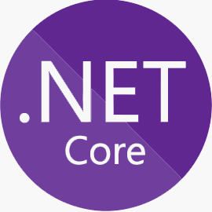
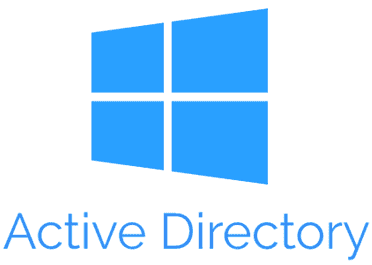
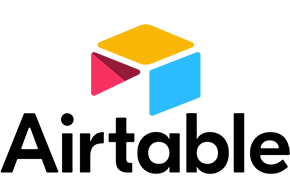
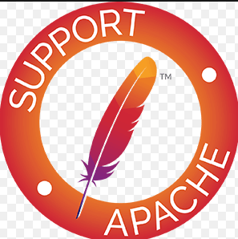
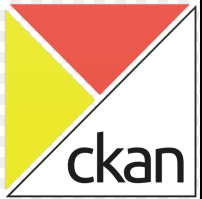
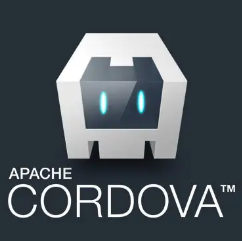

# 1. Assignment 01

## 1.1. Table of Contents

## 1.2. Technology Categories

### 1.2.1. JavaScript Technologies

### 1.2.2. Database Technologies

### 1.2.3. Web Development Technologies

### 1.2.4. Networking and Security Technologies

### 1.2.5. Virtualization and Containerization Technologies

### 1.2.6. Monitoring and DevOps Technologies

### 1.2.7. Content Management Technologies

### 1.2.8. Machine Learning and Data Science Technologies

### 1.2.9. Version Control and Package Management Technologies

### 1.2.10. Business Intelligence and Analytics Technologies

### 1.2.11. API and Web Service Technologies

### 1.2.12. Big Data and Analytics Technologies

### 1.2.13. Internet of Things (IoT) Technologies

### 1.2.14. JavaScript_Technologies

  

1. NetCore  

* Description: **.NetCore** is an open-source, cross-platform framework for building modern applications. It provides a runtime, libraries, and tools to develop applications for various platforms, including Windows, macOS, and Linux.   *Stable Release 7.0.9[1] Edit this on Wikidata / 11 July 2023*.

  * **Official Site:** <https://dotnet.microsoft.com/en-us/>
  * **Wikipedia:** <https://en.wikipedia.org/wiki/.NET>
  * **Version Control Repository:** <https://github.com/dotnet/core>
* **License Key:** <b> License is MIT </b>

2. Active Directory  

* Description: **Active Directory** is a directory service developed by Microsoft that provides centralized authentication, authorization, and management of network resources in a Windows environment. It enables administrators to manage users, groups, computers, and other network components.

  * **Official Site:** <https://learn.microsoft.com/en-us/windows-server/identity/ad-ds/get-started/virtual-dc/active-directory-domain-services-overview>
  * **Wikipedia:** <https://en.wikipedia.org/wiki/Active_Directory>
  * **Version Control Repository:** <https://github.com/topics/active-directory>
* **License Key:** <https://learn.microsoft.com/en-us/windows/deployment/volume-activation/activate-using-active-directory-based-activation-client>

3. Airtable  

<!--   -->

* Description: **Airtable** is a cloud-based collaboration platform that combines the functionality of a spreadsheet with a database. It allows users to organize and track data, collaborate with team members, and create customizable workflows.

  * **Official Site:** <https://www.airtable.com/>
  * **Wikipedia:** <https://en.wikipedia.org/wiki/Airtable>
  * **Version Control Repository:** <https://github.com/Airtable>
* **License Key:** <https://www.airtable.com/tos>

4. Alfresco  

* Description: **Alfresco** is an open-source enterprise content management platform that enables organizations to manage, collaborate on, and distribute digital content. It provides document management, records management, workflow automation, and collaboration features.

  * **Official Site:** <https://www.alfresco.com/>
  * **Wikipedia:** <https://en.wikipedia.org/wiki/Alfresco_Software>
  * **Version Control Repository:** <https://github.com/Alfresco/alfresco-community-repo>
* **License Key:** <https://en.wikipedia.org/wiki/GNU_Lesser_General_Public_License>

5. Angular  

* Description: **Angular** is a popular JavaScript framework for building web applications. It provides a structured approach to web development and offers features like two-way data binding, dependency injection, and modular architecture.

  * **Official Site:** <https://angular.io/>
  * **Wikipedia:** <https://en.wikipedia.org/wiki/Angular_(web_framework)>
  * **Version Control Repository:** <https://github.com/angular/angular>
* **License Key:** <b>License MIT</b>

6. Apache HTTP Server  

* Description: **Apache HTTP Server** often referred to as Apache, is a widely used open-source web server software. It powers a significant portion of websites on the internet and supports various technologies like PHP, Perl, and Python for dynamic content.  
  
  *Stable Release 2.4.57[2] Edit this on Wikidata / 7 April 2023*  
  
  * **Official Site:** <https://httpd.apache.org/>
  * **Wikipedia:**  <https://en.wikipedia.org/wiki/Apache_HTTP_Server>
  * **Version Control Repository:**  <http://svn.apache.org/repos/asf/httpd/httpd/>
* **License Key:** <b>License MIT</b>

7. AtoM  

* Description: **AtoM** is an open-source web-based application designed for managing and providing access to archival and museum collections. It facilitates the description, organization, and dissemination of digital and analog records 
  
  *Stable Release 2.4.57[2] Edit this on Wikidata / 7 April 2023*  
  
  * **Official Site:** <https://www.accesstomemory.org/en/>
  * **Wikipedia:**  <https://en.wikipedia.org/wiki/Apache_HTTP_Server>
  * **Version Control Repository:**  <http://svn.apache.org/repos/asf/httpd/httpd/>
* **License Key:** <b>License Key is Permissive</b>

8. AutoHotkey  

* Description: **AutoHotkey** is a scripting language and automation tool for Windows. It allows users to create macros and automate repetitive tasks, customize keyboard shortcuts, and create GUI applications. 
  
  *v2.0.0 / December 20, 2022; 6 months ago*  
  
  * **Official Site:** <https://www.autohotkey.com/>
  * **Wikipedia:**  <https://en.wikipedia.org/wiki/AutoHotkey>
  * **Version Control Repository:**  <https://github.com/AutoHotkey/AutoHotkey>
* **License Key:** <b>License Key is GPLv2</b>

9. AutoIt  

* Description: **AutoIt** is a scripting language and automation tool for Windows. It is primarily used for automating GUI interactions and scripting tasks like installation, file manipulation, and system monitoring. 
  
  *3.3.16.1 / September 19, 2022; 9 months ago*  
  
  * **Official Site:** <https://www.autoitscript.com/site//>
  * **Wikipedia:**  <https://en.wikipedia.org/wiki/AutoIt>
  * **Version Control Repository:**  <https://www.autoitscript.com/forum/topic/55832-the-repository/>
* **License Key:** <b>License Key is Freeware</b>

10. Bash  

* Description: **Bash (Bourne Again SHell)** is a widely used command-line shell and scripting language on Unix-based operating systems. It provides a command-line interface for interacting with the operating system and executing scripts. 
  
  *3.3.16.1 / September 19, 2022; 9 months ago*  
  
  * **Official Site:** <https://www.gnu.org/software/bash/>
  * **Wikipedia:**  <https://en.wikipedia.org/wiki/Bash_(Unix_shell)>
  * **Version Control Repository:**  <https://git.savannah.gnu.org/cgit/bash.git>
* **License Key:** <b>License Key is GPL-3.0-or-later</b>

11.  Blazor  

* Description: **Blazor** Blazor is a framework for building interactive web applications using C# and .NET. It allows developers to create web applications that run entirely in the browser, eliminating the need for separate client-side and server-side codebases.  
  
  * **Official Site:** <https://dotnet.microsoft.com/en-us/apps/aspnet/web-apps/blazor>
  * **Wikipedia:**  <https://en.wikipedia.org/wiki/Blazor>
  * **Version Control Repository:**  <https://github.com/dotnet/aspnetcore/tree/main/src/Components>
* **License Key:** <b>License Key is Apache License 2.0</b>

12. Bootstrap  

* Description: **Bootstrap** is a popular open-source front-end framework for building responsive and mobile-first websites and web applications. It provides pre-built CSS and JavaScript components, grids, and styles that simplify web development. 
  
  *v5.3.0-alpha3 / April 3, 2023; 3 months ago*  
  
  * **Official Site:** <https://getbootstrap.com/>
  * **Wikipedia:**  <https://en.wikipedia.org/wiki/Bootstrap_(front-end_framework)>
  * **Version Control Repository:**  <https://github.com/twbs/bootstrap>
* **License Key:** <b>License Key is MIT License (Apache License 2.0 prior to 3.1.0)</b>

13. Bower  

* Description: **Bower** is a package manager for managing front-end dependencies in web projects. It allows developers to easily install and update libraries, frameworks, and other assets needed for web development. 
  
  * **Official Site:** <https://bower.io/docs/about/>
  * **Wikipedia:**  <https://soos.io/what-is-bower>
  * **Version Control Repository:**  <https://github.com/bower/bower>
* **License Key:** <b>License Key is MIT License (Apache License 2.0 prior to 3.1.0)</b>

14. Browserify  

* Description: **Browserify** is a tool that enables developers to use Node.js-style modules in the browser. It bundles JavaScript modules and their dependencies into a single file, making it easier to manage and load them in web applications. 
  
  * **Official Site:** <https://browserify.org/>
  * **Wikipedia:**  <https://en.wikipedia.org/wiki/Browserify>
  * **Version Control Repository:**  <https://github.com/browserify/browserify>
* **License Key:** <b>License Key is MIT License</b>

15. Caddy  

* Description: **Caddy** is an open-source web server that emphasizes simplicity and security. It automatically enables HTTPS for websites, supports HTTP/2, and provides features like automatic SSL certificate management. 

    *2.6.4 / 14 February 2023; 5 months ago*  
  
  * **Official Site:** <https://caddyserver.com/>
  * **Wikipedia:**  <https://en.wikipedia.org/wiki/Caddy_(web_server)>
  * **Version Control Repository:**  <https://github.com/caddyserver/caddy>
* **License Key:** <b>License Key is Apache 2</b>

16. Cassandra  

* Description: **Cassandra** is a highly scalable and distributed NoSQL database designed for handling large amounts of data across multiple servers. It offers high availability, fault tolerance, and linear scalability, making it suitable for big data applications. 

    *4.1.2 Edit this on Wikidata / 29 May 2023; 48 days ago*  
  
  * **Official Site:** <https://cassandra.apache.org/_/index.html>
  * **Wikipedia:**  <https://en.wikipedia.org/wiki/Apache_Cassandra>
  * **Version Control Repository:**  <https://github.com/apache/cassandra>
* **License Key:** <b>License Key is Apache 2</b>

17. Chocolatey  

* Description: **Chocolatey** is a package manager for Windows that allows easy installation, management, and updating of software packages. It simplifies the process of installing and maintaining software on Windows machines. 

    *2.1.0 / 29 June 2023; 12 days ago*  
  
  * **Official Site:** <https://chocolatey.org/>
  * **Wikipedia:**  <https://en.wikipedia.org/wiki/Chocolatey>
  * **Version Control Repository:**  <https://github.com/chocolatey/choco>
* **License Key:** <b>License Key is Apache 2</b>

18. CiviCRM  

* Description: **CiviCRM** is an open-source customer relationship management (CRM) system designed for nonprofit organizations and associations. It provides tools for managing contacts, memberships, donations, events, and communications. 

    *5.57 / January 4, 2023; 6 months ago*  
  
  * **Official Site:** <https://civicrm.org/>
  * **Wikipedia:**  <https://en.wikipedia.org/wiki/CiviCRM>
  * **Version Control Repository:**  <https://lab.civicrm.org/dev/core>
* **License Key:** <b>License Key is AGPLv3</b>

19. CKAN  

* Description: **CKAN** is an open-source data management platform used for organizing, publishing, and sharing datasets. It provides features for data storage, metadata management, search, and API access, making it useful for open data initiatives. 

    *2.10.0[1] / 15 February 2023*  
  
  * **Official Site:** <https://ckan.org/>
  * **Wikipedia:**  <https://en.wikipedia.org/wiki/CKAN>
  * **Version Control Repository:**  <https://github.com/ckan/ckan>
* **License Key:** <b>License Key is AGPL</b>

20. Cordova  

* Description: **Cordova** also known as Apache Cordova, is an open-source platform for building mobile applications using HTML, CSS, and JavaScript. It allows developers to create mobile apps that can be deployed on multiple platforms, including iOS and Android.      

    *2.10.0[1] / 15 February 2023*  
  
  * **Official Site:** <https://cordova.apache.org/>
  * **Wikipedia:**  <https://en.wikipedia.org/wiki/Apache_Cordova>
  * **Version Control Repository:**  <https://github.com/apache/cordova>
* **License Key:** <b>License Key is Apache License 2.0</b>

1 ~~.NET Core~~         34 Grav 67 PowerBI
2 ~~Active Directory~~   35 Grunt 68 Powershell
3 ~~Airtable~~           36 Gulp 69 Prisma (ORM)
4 ~~Alfresco~~           37 Hadoop 70 Prometheus
5 ~~Angular~~            38 Heroku 71 R language and environment
6 ~~Apache HTTP Server~~ 39 Home Assistant 72 RAVENDB
7  ????AtoM             40 Hyper-V 73 React
8 ~~AutoHotkey~~         41 InfluxDB 74 Redis
9 ~~AutoIt~~             42 Internet of things 75 REST
10 ~~Bash~~            43 jQuery 76 RethinkDB
11 ~~Blazor~~           44 Kanban 77 RxJS
12 ~~Bootstrap~~        45 Koha 78 Sass (stylesheet language)
13 ~~Bower~~             46 LDAP 79 Scrum
14 ~~Browserify~~        47 Leaflet 80 Selenium
15 ~~Caddy~~             48 Less (stylesheet
language)            81 SharePoint
16 ~~Cassandra~~         49 Lodash 82 SignalR
17 ~~Chocolatey~~        50 Mahout 83 Snowplow
18 ~~CiviCRM~~           51 Moment.js 84 SOAP (Simple Object Access Protocol)
19 ~~CKAN~~              52 MongoDB 85 Solr
20 Cordova           53 Nagios 86 Spring
21 CouchDB           54 NestJS 87 Statamic
22 D3.js             55 NGINX 88 Superset
23 Docker            56 Nmap 89 TDD (Test-driven development)
24 Drupal            57 Node.js 90 Telegraf
25 DSpace (dynamic digital
repository)          58 npm 91 Tensorflow
26 Elasticsearch     59 NuGet 92 Tomcat
27 Elementor         60 Nx 93 TypeScript
28 Entity Framework  61 OData 94 VirtualBox
29 Fiddler           62 Omeka 95 Vue.js
30 Gatsby            63 OpenSearch 96 Wireshark
31 Go                64 pfSense 97 WordPress
32 Grafana           65 Pico 98 Xamarin
33 GraphQL           66 Postman 99 XCP-ng

<!-- 
  [Vue.js]() [Wiki](https://en.wikipedia.org/wiki/.NET), [Version Control Repository](https://github.com/dotnet/core), [License Key](https://en.wikipedia.org/wiki/MIT_License)    
  
  
   [AtoM ](https://httpd.apache.org/) is an open-source web-based application designed for managing and providing access to archival and museum collections. It facilitates the description, organization, and dissemination of digital and analog records  *Stable Release 2.4.57[2] Edit this on Wikidata / 7 April 2023*   [Wiki](https://en.wikipedia.org/wiki/Apache_HTTP_Server), [Version Control Repository](http://svn.apache.org/repos/asf/httpd/httpd/), [License Key](https://en.wikipedia.org/wiki/Apache_License)   <b>License Key is Permissive</b> 
-->
